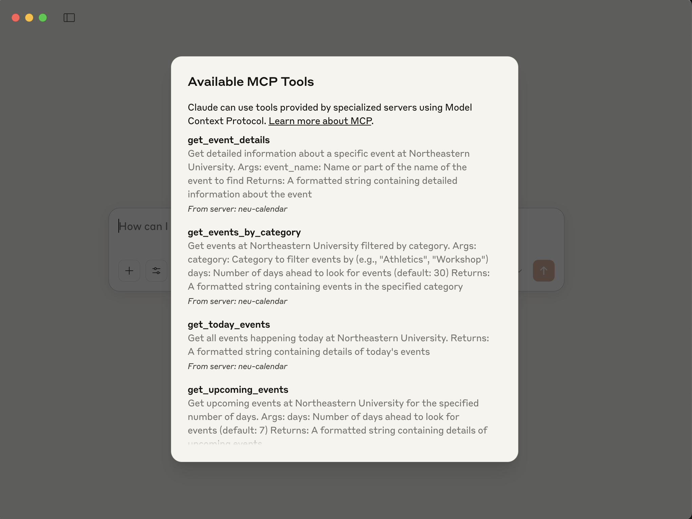
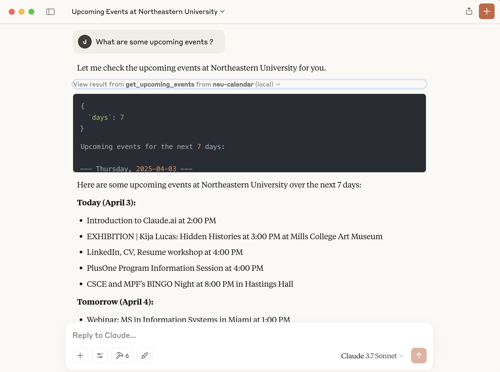
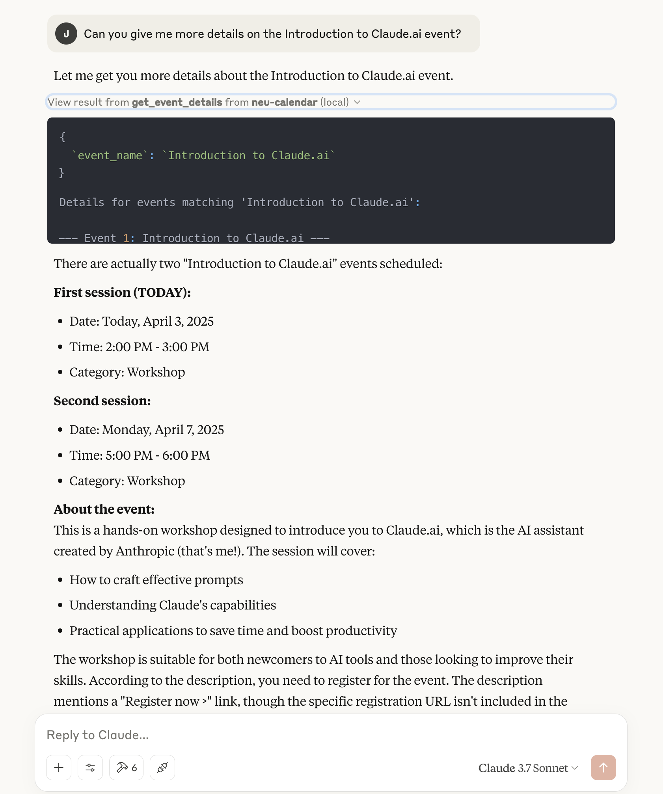
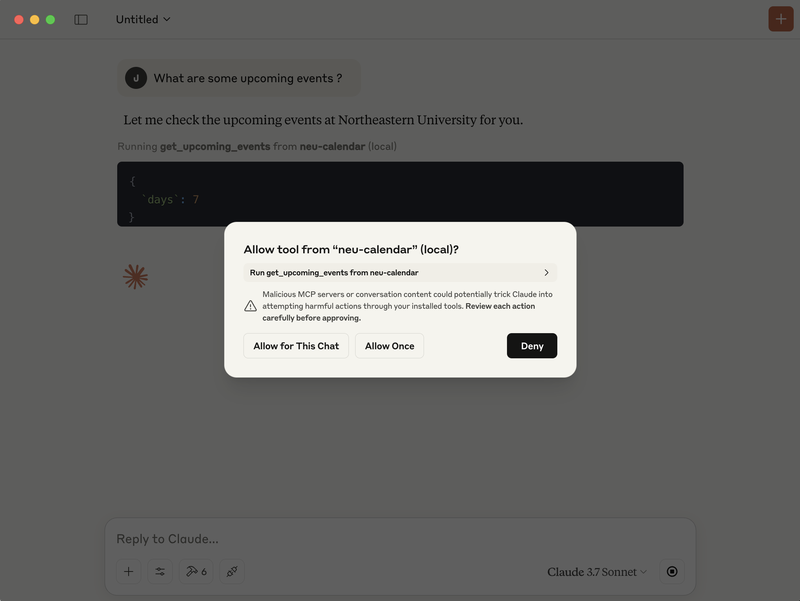

# Northeastern University Calendar MCP Server

This MCP server provides access to Northeastern University's event calendar through the Model Context Protocol (MCP). It allows Claude Desktop to fetch, search, and filter events from the Northeastern University calendar.

## Features

- Get today's events
- Get upcoming events for a specified number of days
- Search events by keywords
- Filter events by category
- Get detailed information about specific events
- List available event categories

## Requirements

- Python 3.9+
- Claude Desktop app
- Internet connection to access the Northeastern University calendar

## Installation

1. Clone or download this repository
2. Create a virtual environment:
```
python -m venv venv
```
3. Activate the virtual environment:
   - On macOS/Linux:
   ```
   source venv/bin/activate
   ```
   - On Windows:
   ```
   venv\Scripts\activate
   ```
4. Install the required dependencies:
```
pip install -r requirements.txt
```

## Usage

### Running the MCP Server

1. Make sure your virtual environment is activated
2. Start the server:
```
python neu_calendar_server.py
```
3. The server will start on localhost port 8000 by default


### Connecting to Claude Desktop

For detailed instructions on setting up the MCP server with Claude Desktop, see [CLAUDE_DESKTOP_SETUP.md](CLAUDE_DESKTOP_SETUP.md).

Quick setup:
1. Open Claude Desktop
2. Go to Settings -> Developer
3. Click "Edit Config"
4. Add the configuration for the NEU Calendar MCP server
5. Restart Claude Desktop

### Using the Extension

Once the extension is installed and the server is running, you can ask Claude about Northeastern University events. For example:

- "What events are happening today at Northeastern University?"
- "Show me upcoming events for the next week"
- "Are there any workshops happening this month?"
- "Tell me about athletic events at Northeastern"
- "What categories of events are available?"


## Screenshots

Here are some examples of the NEU Calendar MCP server in action:

### Available MCP Tools

*The NEU Calendar MCP server provides several tools for interacting with the Northeastern University calendar.*

### Sample Query

*Example of a simple query asking about upcoming events at Northeastern University.*

### Detailed Information Request

*Claude providing detailed information about specific events based on a selected event. In the above case, it identified that the event is about Claude itself. 🙂*

### Tool Usage Permission

*Claude asking for permission before executing a calendar search tool.*

## Troubleshooting

- If Claude can't connect to the server, make sure the server is running and that the port (8000) is not blocked by a firewall
- If the server can't fetch the calendar data, check your internet connection
- If Claude Desktop reports an extension configuration error, verify that the configuration is correct
- See [CLAUDE_DESKTOP_SETUP.md](CLAUDE_DESKTOP_SETUP.md) for detailed troubleshooting steps

## License

This project is provided for educational purposes. Calendar data belongs to Northeastern University.

## Credits

- Calendar data source: [Northeastern University Calendar](https://calendar.northeastern.edu/)
- Built using the Model Context Protocol (MCP) 
